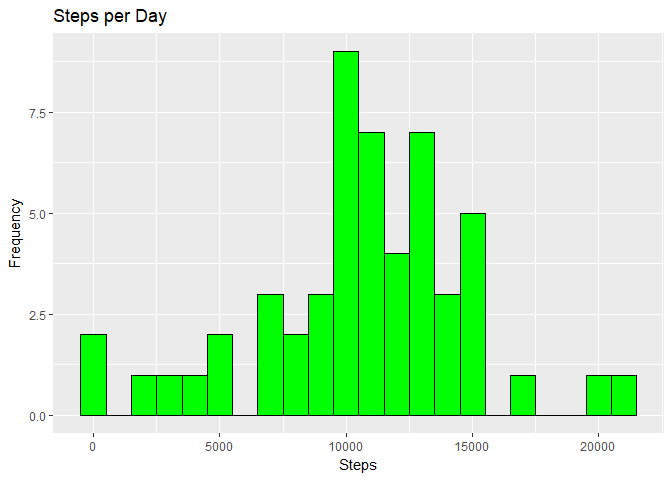
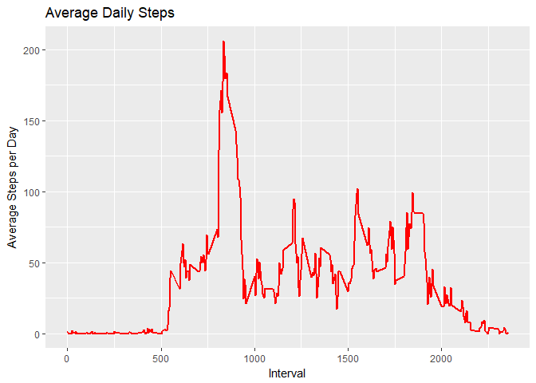
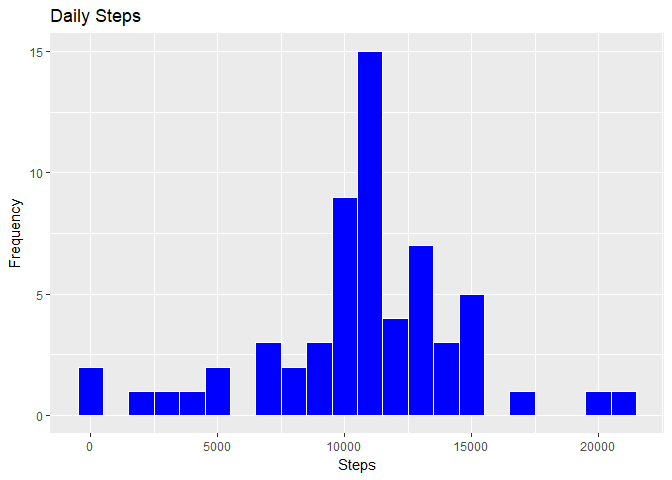
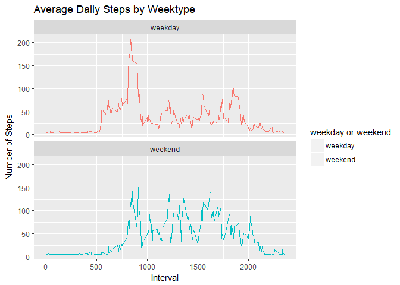

## Loading and preprocessing the data
Unzip the data and read csv file

```r
library(data.table)
library(ggplot2)

url <- "https://d396qusza40orc.cloudfront.net/repdata%2Fdata%2Factivity.zip"
download.file(url, destfile = paste0(getwd(), "/repdata%2Fdata%2Factivity.zip"), method = "curl")
unzip("repdata%2Fdata%2Factivity.zip", exdir = "data")

activityDT <- data.table::fread(input = "data/activity.csv")
```

## What is mean total number of steps taken per day?
1. Calculate total steps per day

```r
Total_Steps <- activityDT[, c(lapply(.SD, sum, na.rm = FALSE)), .SDcols = c("steps"), by = .(date)]
head(Total_Steps, 10)
```

```
##           date steps
##  1: 2012-10-01    NA
##  2: 2012-10-02   126
##  3: 2012-10-03 11352
##  4: 2012-10-04 12116
##  5: 2012-10-05 13294
##  6: 2012-10-06 15420
##  7: 2012-10-07 11015
##  8: 2012-10-08    NA
##  9: 2012-10-09 12811
## 10: 2012-10-10  9900
```
2. Histogram of Total Steps

```r
ggplot(Total_Steps, aes(x = steps)) + geom_histogram(color = "black", fill = "green", binwidth = 1000) +
    labs(title = "Steps per Day", x = "Steps", y = "Frequency")
```

```
## Warning: Removed 8 rows containing non-finite values (stat_bin).
```

<!-- -->
3. Mean and median of total steps per day

```r
Total_Steps[, .(Mean_Steps = mean(steps, na.rm = TRUE), Median_Steps = median(steps, na.rm = TRUE))]
```

```
##    Mean_Steps Median_Steps
## 1:   10766.19        10765
```
## What is the average daily activity pattern?
1. Time series plot of the 5-minute interval (x-axis) and the average number of steps taken, averaged across all days (y-axis)

```r
IntervalDT <- activityDT[, c(lapply(.SD, mean, na.rm = TRUE)), .SDcols = c("steps"), by = .(interval)]
ggplot(IntervalDT, aes(x = interval, y = steps)) + geom_line(color = "red", size =1) +
    labs(title = "Average Daily Steps", x = "Interval", y = "Average Steps per Day")
```

<!-- -->
2. Which 5-minute interval, on average across all the days in the dataset, contains the maximum number of steps?

```r
IntervalDT[steps == max(steps), .(max_interval = interval)]
```

```
##    max_interval
## 1:          835
```

## Imputing missing values
1. The total number of missing values in the dataset

```r
nrow(activityDT[is.na(steps),])
```

```
## [1] 2304
```
2. Devise a strategy for filling in all of the missing values in the dataset. The strategy does not need to be sophisticated.

```r
activityDT[is.na(steps), "steps"] <- activityDT[, c(lapply(.SD, mean, na.rm = TRUE)), .SDcols = c("steps")]
```

```
## Warning in `[<-.data.table`(`*tmp*`, is.na(steps), "steps", value =
## structure(list(: Coerced 'double' RHS to 'integer' to match the column's
## type; may have truncated precision. Either change the target column
## ['steps'] to 'double' first (by creating a new 'double' vector length 17568
## (nrows of entire table) and assign that; i.e. 'replace' column), or coerce
## RHS to 'integer' (e.g. 1L, NA_[real|integer]_, as.*, etc) to make your
## intent clear and for speed. Or, set the column type correctly up front when
## you create the table and stick to it, please.
```
3. Create a new dataset that is equal to the original dataset but with the missing data filled in.

```r
data.table::fwrite(x = activityDT, file = "data/cleanData.csv", quote = FALSE)
```
4. Make a histogram of the total number of steps taken each day and Calculate and report the mean and median total number of steps taken per day. Do these values differ from the estimates from the first part of the assignment? What is the impact of imputing missing data on the estimates of the total daily number of steps?

```r
Total_Steps <- activityDT[, c(lapply(.SD, sum)), .SDcols = c("steps"), by = .(date)]
Total_Steps[, .(Mean_Steps = mean(steps), Median_Steps = median(steps))]
```

```
##    Mean_Steps Median_Steps
## 1:   10751.74        10656
```

```r
ggplot(Total_Steps, aes(x = steps)) + geom_histogram(color = "white", fill = "blue", binwidth = 1000) +
    labs(title = "Daily Steps", x = "Steps", y = "Frequency")
```

<!-- -->
Estimate Type | Mean Steps | Median Steps
--- |--- | --- |
With the NAs | 10766.19 | 10765
Without the NAs filled by the Mean | 10751.74 | 10656

## Are there differences in activity patterns between weekdays and weekends?
Create a new factor variable in the dataset with two levels – “weekday” and “weekend” indicating whether a given date is a weekday or weekend day.

```r
activityDT[, date := as.POSIXct(date, format = "%Y-%m-%d")]
activityDT[, `Day of Week`:= weekdays(x = date)]
activityDT[grepl(pattern = "Monday|Tuesday|Wednesday|Thursday|Friday", x = `Day of Week`), "weekday or weekend"] <- "weekday"
activityDT[grepl(pattern = "Saturday|Sunday", x = `Day of Week`), "weekday or weekend"] <- "weekend"
activityDT[, `weekday or weekend` := as.factor(`weekday or weekend`)]
head(activityDT, 10)
```

```
##     steps       date interval Day of Week weekday or weekend
##  1:    37 2012-10-01        0      Monday            weekday
##  2:    37 2012-10-01        5      Monday            weekday
##  3:    37 2012-10-01       10      Monday            weekday
##  4:    37 2012-10-01       15      Monday            weekday
##  5:    37 2012-10-01       20      Monday            weekday
##  6:    37 2012-10-01       25      Monday            weekday
##  7:    37 2012-10-01       30      Monday            weekday
##  8:    37 2012-10-01       35      Monday            weekday
##  9:    37 2012-10-01       40      Monday            weekday
## 10:    37 2012-10-01       45      Monday            weekday
```
Make a panel plot containing a time series plot (i.e. \color{red}{\verb|type = "l"|}type="l") of the 5-minute interval (x-axis) and the average number of steps taken, averaged across all weekday days or weekend days (y-axis).

```r
IntervalDT <- activityDT[, c(lapply(.SD, mean, na.rm = TRUE)), .SDcols = c("steps"), by = .(interval, `weekday or weekend`)] 

ggplot(IntervalDT , aes(x = interval , y = steps, color=`weekday or weekend`)) + geom_line() + labs(title = "Average Daily Steps by Weektype", x = "Interval", y = "Number of Steps") + facet_wrap(~`weekday or weekend` , ncol = 1, nrow=2)
```

<!-- -->
